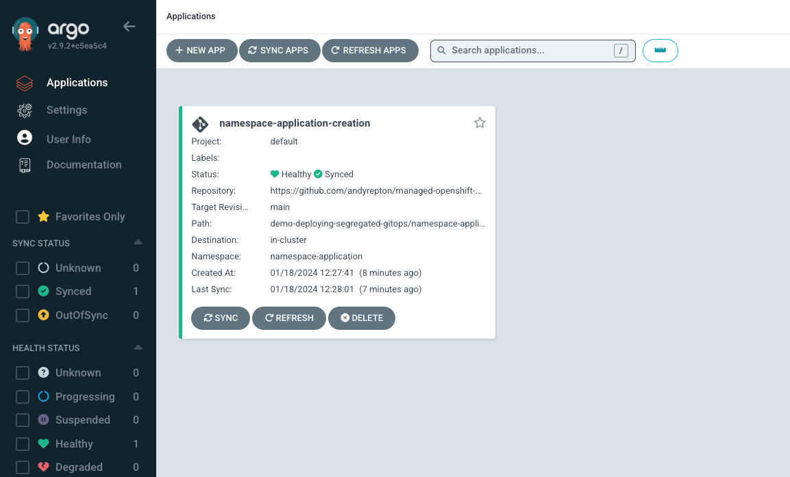
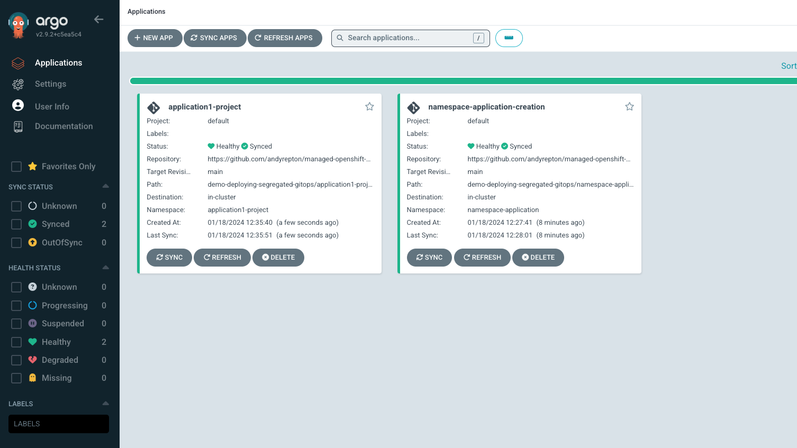

# Deploying segregated GitOps instances for developer teams

## Rationale

When deploying OpenShift GitOps, the operator will automatically make an ArgoCD Instance for you. This instance is typically referred to as the "Cluster" ArgoCD, though in practise it is identical to any other ArgoCD instance.

One option is to use this central ArgoCD instance to manage all applications in your cluster. This has both pros and cons:

Pros:
- Simplicity, there is one place for everything
- Less resource overhead

Cons:
- Blast radius: a single mistake in the upstream repo can result in the cluster being degraded or destroyed
- Security: Multiple teams may be able to affect other teams work

There are multiple ways to solve the security angle, such as having one team manage Applications, and pointing at different repositories, or using OWNERS based controls on your git repositories. However, one way to move around this is instead to have individual ArgoCD instances inside the relevant namespaces and only allow access to those. This has both pros and cons:

Pros:
- Failure protection: Each ArgoCD's blast radius is limited to it's own namespace only
- Simplified security: Users can use OpenShift's RBAC controls to restrict access to a namespace only

This demo will focus on a pattern of a Platform Engineering team, using their own ArgoCD instance (the "Cluster" one), to deploy projects and ArgoCD's into a ROSA cluster.

## Important terms

- OpenShift GitOps: An Operator capable of deploying ArgoCD instances, Application resources and more (for this demo we will focus on these two only)
- ArgoCD: An instance of ArgoCD insid the cluster
- Application: A CustomResource that defines an ArgoCD Application, which usually will point at a repository containing additional OpenShift resources (it can also point at a Helm repository, but this is out of scope for this demo)
- Repository: A Git repository that can be reached from the cluster

## Deploying the Cluster ArgoCD

We will start by installing the OpenShift GitOps Operator, which will install the "Cluster" ArgoCD. We can do this by running the instructions in the [../openshift-gitops](../openshift-gitops) folder

You can check that ArgoCD is running by checking the status of it:

```bash
oc describe argocd -n openshift-gitops | grep Phase
  Phase:                       Available
```

Once the cluster ArgoCD is available, you can get the route to login like so:

```bash
oc get route openshift-gitops-server -n openshift-gitops
```

You can use this to visually follow the work we are doing on the command line

## Creating an Applicaton to deploy our Application Team namespace

We will start by creating a basic application that creates a new project for our application team, and deploys a RoleBinding for this namespace to allow our team to access it (configuring an idp is outside of the scope of this demo). We are assuming that your users are in a group named `application1-team` here.

In the namespace-application folder, there are two OpenShift resources, a namespace and a RoleBinding. Review these before returning here.

We now need to tell our ArgoCD to view these files, and apply them into our cluster. We do this via an Application resource (see Important Terms above if needed). Create the Application Resource via the following command:

```bash
cat <<EOF | oc apply -f -
apiVersion: argoproj.io/v1alpha1
kind: Application
metadata:
  name: namespace-application-creation
  namespace: openshift-gitops
spec:
  destination:
    namespace: namespace-application
    server: https://kubernetes.default.svc
  project: default
  source:
    directory:
      recurse: false
    path: demo-deploying-segregated-gitops/namespace-application
    repoURL: https://github.com/andyrepton/managed-openshift-demos
    targetRevision: main
  syncPolicy:
    syncOptions:
    - CreateNamespace=false
    automated:
      prune: true
      selfHeal: true
EOF
```

This will create an Application in our ArgoCD, pointing at the files in this repository, at the path we specified and have the "Cluster" ArgoCD apply them.

Check that your application is healthy:

```bash
oc get applications -n openshift-gitops
NAME                             SYNC STATUS   HEALTH STATUS
namespace-application-creation   Synced        Healthy
```

And now you should be able to confirm our resources have been created:

```bash
oc get project namespace-application
NAME                    DISPLAY NAME   STATUS
namespace-application                  Active

oc get rolebinding namespace-application -n namespace-application
NAME                    ROLE                AGE
namespace-application   ClusterRole/admin   73s
```

You should see the following in your ArgoCD if you are using the UI:



## Creating an Application to deploy our second ArgoCD

As an ArgoCD instance is just another OpenShift resource, we can now expand upon this idea to start creating additional ArgoCD instances using our "Cluster" ArgoCD, in addition to our namespace and rolebinding. There is a new folder in this repository, at [application1-project](application1-project). Review the new argocd.yaml file.

Let's create another Application, this time by specifying the application1-project folder path:

```bash
cat <<EOF | oc apply -f -
apiVersion: argoproj.io/v1alpha1
kind: Application
metadata:
  name: application1-project
  namespace: openshift-gitops
spec:
  destination:
    namespace: application1-project
    server: https://kubernetes.default.svc
  project: default
  source:
    directory:
      recurse: false
    path: demo-deploying-segregated-gitops/application1-project
    repoURL: https://github.com/andyrepton/managed-openshift-demos
    targetRevision: main
  syncPolicy:
    syncOptions:
    - CreateNamespace=false
    automated:
      prune: true
      selfHeal: true
EOF
```

You can now see that a new Application has been created, which is the setup for the Application1-Project.

You should see the following in your ArgoCD if you are using the UI:



You can test that you can access your new ArgoCD:

```bash
oc get project application1-project
NAME                   DISPLAY NAME   STATUS
application1-project                  Active

oc get argocd -n application1-project
NAME                  AGE
application1-argocd   39s

oc get route -n application1-project application1-argocd-server
NAME                         HOST/PORT                                                                                  PATH   SERVICES                     PORT    TERMINATION          WILDCARD
application1-argocd-server   application1-argocd-server-application1-project.apps.poc-andyr.btk0.p1.openshiftapps.com          application1-argocd-server   https   reencrypt/Redirect   None
```

To get the admin password for this ArgoCD Instance, you can use the following command:

```bash
oc get secret -n application1-project application1-argocd-cluster -o jsonpath='{.data.admin\.password}' | base64 -D
```

> Note: The secret name will be the name of your argocd cluster plus `-cluster` on the end. As we called this ArgoCD application1-argocd, this is why the secret is named thus. Please edit this for additional clusters.

## Conclusion

This demo has hopefully opened up some possibitilies of how a central Platform Engineering team can manage multiple Application Projects from a central repository, giving flexibility to application teams on demand.

Ideas for next steps for users to explore:
- Using Kustomize to make multiple Application Projects at the same time
- Creating the Application resource yamls themselves inside a git repository rather than using `oc apply`
- Adding namespace quotas, network policies etc to Application projects
