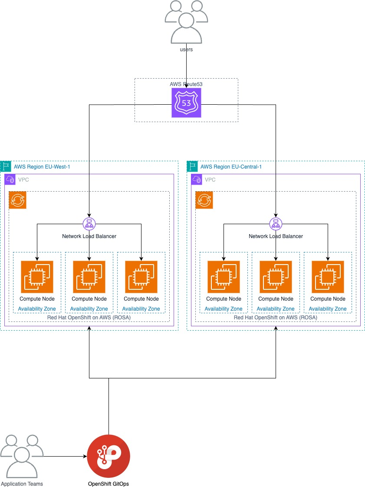

# Multi region ROSA example



## Ahead of time

- Ensure you have two ROSA clusters. You can use the terraform in ./rosa-terraform to achieve this

- Create your users:

```
oc config delete-context ${TF_VAR_cluster_name}-1
rosa create admin -c ${TF_VAR_cluster_name}-1
rosa login... (from above)
# Ensure "Login successful" message
oc config rename-context $(oc config current-context) ${TF_VAR_cluster_name}-1

oc config delete-context ${TF_VAR_cluster_name}-2
rosa create admin -c ${TF_VAR_cluster_name}-2
rosa login... (from above)
# Ensure "Login successful" message
oc config rename-context $(oc config current-context) ${TF_VAR_cluster_name}-2
```

- Organise a new domain name for your cluster. Here I am using `poc-andyr.labs.aws.andyrepton.com`. I've made this already in AWS

```
export DOMAIN=poc-andyr.labs.aws.andyrepton.com
export DOMAIN_DASH=$(echo $DOMAIN | tr . -)
export INGRESS_NAME=ha-ingress
export CERT_NAME=${DOMAIN_DASH}-tls-cert
export SCOPE="External" 
```

- Deploy our Hello World app:

```
oc new-app golang~https://github.com/andyrepton/hello --env=CLOUD_REGION=eu-west-1 --env=OPENSHIFT_TYPE=ROSA --env=CLOUD_TYPE=AWS
oc expose deployment hello --port 8080
oc create route edge --service=hello --insecure-policy=Redirect --hostname=hello.$DOMAIN --port=8080
```

## During the demo


- Configure an additional ingress controller in each cluster, with our new domain (follow instructions here: https://cloud.redhat.com/experts/rosa/ingress-controller/)

```
oc config use-context ${TF_VAR_cluster_name}-1

oc create secret tls ${DOMAIN_DASH}-tls-cert --key=/Users/arepton/certbot/config/live/accelerator.poc-andyr.labs.aws.andyrepton.com/privkey.pem --cert=/Users/arepton/certbot/config/live/accelerator.poc-andyr.labs.aws.andyrepton.com/fullchain.pem -n openshift-ingress

envsubst  <<EOF | oc apply -f -
apiVersion: operator.openshift.io/v1
kind: IngressController
metadata:
  annotations:
    ingress.operator.openshift.io/auto-delete-load-balancer: "true"
  finalizers:
  - ingresscontroller.operator.openshift.io/finalizer-ingresscontroller
  generation: 2
  labels:
    hypershift.openshift.io/managed: "true"
  name: $INGRESS_NAME
  namespace: openshift-ingress-operator
spec:
  clientTLS:
    clientCA:
      name: ""
    clientCertificatePolicy: ""
  defaultCertificate:
    name: $CERT_NAME
  domain: $DOMAIN
  endpointPublishingStrategy:
    loadBalancer:
      dnsManagementPolicy: Unmanaged
      providerParameters:
        aws:
          networkLoadBalancer: {}
          type: NLB
        type: AWS
      scope: $SCOPE
    type: LoadBalancerService
  httpCompression: {}
  httpEmptyRequestsPolicy: Respond
  httpErrorCodePages:
    name: ""
  replicas: 2
  tuningOptions:
    reloadInterval: 0s
  unsupportedConfigOverrides: null
EOF


oc config use-context ${TF_VAR_cluster_name}-2

oc create secret tls ${DOMAIN_DASH}-tls-cert --key=/Users/arepton/certbot/config/live/accelerator.poc-andyr.labs.aws.andyrepton.com/privkey.pem --cert=/Users/arepton/certbot/config/live/accelerator.poc-andyr.labs.aws.andyrepton.com/fullchain.pem -n openshift-ingress

envsubst  <<EOF | oc apply -f -
apiVersion: operator.openshift.io/v1
kind: IngressController
metadata:
  annotations:
    ingress.operator.openshift.io/auto-delete-load-balancer: "true"
  finalizers:
  - ingresscontroller.operator.openshift.io/finalizer-ingresscontroller
  generation: 2
  labels:
    hypershift.openshift.io/managed: "true"
  name: $INGRESS_NAME
  namespace: openshift-ingress-operator
spec:
  clientTLS:
    clientCA:
      name: ""
    clientCertificatePolicy: ""
  defaultCertificate:
    name: $CERT_NAME
  domain: $DOMAIN
  endpointPublishingStrategy:
    loadBalancer:
      dnsManagementPolicy: Unmanaged
      providerParameters:
        aws:
          networkLoadBalancer: {}
          type: NLB
        type: AWS
      scope: $SCOPE
    type: LoadBalancerService
  httpCompression: {}
  httpEmptyRequestsPolicy: Respond
  httpErrorCodePages:
    name: ""
  replicas: 2
  tuningOptions:
    reloadInterval: 0s
  unsupportedConfigOverrides: null
EOF
```

- Start by getting the ARNs of the two NLBs:

```
oc config use-context ${TF_VAR_cluster_name}-1
NLB_HOSTNAME=$(oc get service -n openshift-ingress router-${INGRESS_NAME} -o jsonpath='{.status.loadBalancer.ingress[0].hostname}')
NLB_NAME=$(echo $NLB_HOSTNAME | sed 's/-.*//')
NLB_REGION=$(echo $NLB_HOSTNAME | cut -d "." -f 3)

echo $NLB_NAME

NLB_ARN_1=$(aws elbv2 describe-load-balancers --name $NLB_NAME --region $NLB_REGION | jq -r ".LoadBalancers[0].LoadBalancerArn")

oc config use-context ${TF_VAR_cluster_name}-2
NLB_HOSTNAME=$(oc get service -n openshift-ingress router-${INGRESS_NAME} -o jsonpath='{.status.loadBalancer.ingress[0].hostname}')
NLB_NAME=$(echo $NLB_HOSTNAME | sed 's/-.*//')
NLB_REGION=$(echo $NLB_HOSTNAME | cut -d "." -f 3)

echo $NLB_NAME

NLB_ARN_2=$(aws elbv2 describe-load-balancers --name $NLB_NAME --region $NLB_REGION | jq -r ".LoadBalancers[0].LoadBalancerArn")

echo $NLB_ARN_1
echo $NLB_ARN_2
```

### Route53 Version

- We will now show an application deployed to two different clusters, with Route53 load balancing across both.

- Create the records using Terraform

```
cd route53
export TF_VAR_rosa_1_nlb=$NLB_ARN_1
export TF_VAR_rosa_2_nlb=$NLB_ARN_2
export TF_VAR_rosa_1_weight=100
export TF_VAR_rosa_2_weight=0
export TF_VAR_route53_zone="Z025509125Q55IDC9EYHS" #Replace this with yours if you're not Andy
terraform init
terraform plan
terraform apply
```

- We can now check our app (open in browser):

```
$ curl -k https://hello.poc-andyr.labs.aws.andyrepton.com/
```

- Now, let's swap to our other cluster by setting the weight to zero

```
export TF_VAR_rosa_1_weight=0
export TF_VAR_rosa_2_weight=100
terraform apply
```

- And now we can balance both:

```
export TF_VAR_rosa_1_weight=50
export TF_VAR_rosa_2_weight=50
terraform apply
```

- We can now simulate a failure by breaking our ingress controller:

```
oc config use-context ${TF_VAR_cluster_name}-2
oc delete secret ${DOMAIN_DASH}-tls-cert -n openshift-ingress
oc scale deploy router-${INGRESS_NAME} --replicas=0 -n openshift-ingress
```

- We can see that shortly all of the health checks will fail:

```
aws elbv2 describe-target-health --region=eu-central-1 --target-group-arn=$(aws elbv2 describe-target-groups --region=eu-central-1 --load-balancer-arn=${TF_VAR_rosa_2_nlb} --query 'TargetGroups[0].TargetGroupArn' --output text)

### Example output:

{
    "TargetHealthDescriptions": [
        {
            "Target": {
                "Id": "i-0539dc05c1ff0ef98",
                "Port": 32539
            },
            "HealthCheckPort": "32366",
            "TargetHealth": {
                "State": "unhealthy",
                "Reason": "Target.FailedHealthChecks",
                "Description": "Health checks failed"
            }
        },
        {
            "Target": {
                "Id": "i-07584c0d79e352320",
                "Port": 32539
            },
            "HealthCheckPort": "32366",
            "TargetHealth": {
                "State": "unhealthy",
                "Reason": "Target.FailedHealthChecks",
                "Description": "Health checks failed"
            }
        },
        {
            "Target": {
                "Id": "i-09d6d0c8e98aa4be0",
                "Port": 32539
            },
            "HealthCheckPort": "32366",
            "TargetHealth": {
                "State": "unhealthy",
                "Reason": "Target.FailedHealthChecks",
                "Description": "Health checks failed"
            }
        }
    ]
}
```

- All traffic will now start routing only to the other cluster

- And now we fix it:

```
oc config use-context ${TF_VAR_cluster_name}-2
oc create secret tls ${DOMAIN_DASH}-tls-cert --key=/Users/arepton/certbot/config/live/accelerator.poc-andyr.labs.aws.andyrepton.com/privkey.pem --cert=/Users/arepton/certbot/config/live/accelerator.poc-andyr.labs.aws.andyrepton.com/fullchain.pem -n openshift-ingress
# Wait for a moment and the deployment will kick in automatically
```

### Global Accelerator version

- We will now show an application deployed to two different clusters, with Global Accelerator load balancing across both.

- Create the Global Accelerator using Terraform

```
cd global-accelerator
export TF_VAR_rosa_1_nlb=$NLB_ARN_1
export TF_VAR_rosa_2_nlb=$NLB_ARN_2
export TF_VAR_route53_zone="Z025509125Q55IDC9EYHS" #Replace this with yours if you're not Andy
terraform init
terraform plan
terraform apply
```

- Create the new routes with Global Accelerator:

```
oc config use-context ${TF_VAR_cluster_name}-1
oc create route edge ga-hello --service=hello --insecure-policy=Redirect --hostname=hello.accelerator.poc-andyr.labs.aws.andyrepton.com --port=8080

oc config use-context ${TF_VAR_cluster_name}-2
oc create route edge ga-hello --service=hello --insecure-policy=Redirect --hostname=hello.accelerator.poc-andyr.labs.aws.andyrepton.com --port=8080
```

- And test:

```
$ curl https://hello.accelerator.poc-andyr.labs.aws.andyrepton.com/

	<!DOCTYPE html>
	<html>
	<head>
		<style>
			.container {
				display: flex;
				flex-direction: column;
				align-items: center;
				justify-content: center;
				height: 100vh;
				text-align: center;
			}
			h1 {
				font-size: 2em;
			}
			.arch {
				font-size: 1.5em;
				color: #2c3e50;
				margin-top: 20px;
				font-weight: bold;
			}
		</style>
	</head>
	<body>
		<div class="container">
			
			<h1>I love Application Platforms!</h1>
			<p class="arch">CPU Architecture: amd64</p>
			<p class="arch">ROSA running on AWS in eu-central-1</p>
		</div>
	</body>
	</html>
```

## Clean up

```
cd global-accelerator
terraform destroy

cd ../route53
terraform destroy

cd ../rosa-terraform
terraform destroy
```
