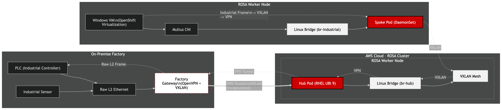

# Stretched layer 2 example with ROSA

## Goal

A customer approached the Black Belt team looking for a way for legacy systems, using protocols such as Profinet, BACNet etc could be connected to Virtual Machines running in OpenShift Virt on ROSA. This is an example way to do this without needing to edit ec2 instance NICs

## Overview

```
FACTORY FLOOR (L2)           AWS VPC / ROSA CLUSTER (L3)
==================           ===============================================

[ PLC / Sensor ]             [ WORKER NODE A ]           [ WORKER NODE B ]
      |                      |---------------|           |---------------|
      |                      | [ HUB POD ]   |           | [ SPOKE POD ] |
      |                      |    (UBI 9)    |           |    (UBI 9)    |
      |                      |       |       |           |       |       |
(Raw Ethernet)               |   [br-hub]    |<==VXLAN==>| [br-industrial]
      |                      |       |       |  (L2 over |       |       |
      |                      |    [tap0]     |   VPC L3) |   [Multus]    |
      |                      |       |       |           |       |       |
[ Factory Gateway ]          |   [OpenVPN]   |           | [ Windows VM ]|
[ (VPN + VXLAN)   ] <==VPN==>| [ (eth0)  ]   |           | [ (VirtIO)   ]|
==================           =================           =================
      ^                              ^                           ^
      |                              |                           |
  Physical Wire                The "Patch Panel"           The Workload
 (Profinet RT)                (Central Router)            (PCS 7 / App)
```

Mermaid diagram:



## The Architecture: "Hub & Spoke" Tunneling
Since AWS VPCs are strictly Layer 3 and do not support native broadcast/multicast, we utilize a **Double-Encapsulation Tunnel** (VXLAN inside OpenVPN) to "hide" the Layer 2 frames from the AWS routing fabric.

1.  **The Hub (Deployment):** A central Red Hat UBI-based Pod that maintains an **OpenVPN (TAP mode)** connection to the factory. It acts as the "Grand Central Station" or "Virtual Patch Panel."
2.  **The Spoke (DaemonSet):** A Pod on every worker node that creates a local Linux bridge (`br-industrial`) on the host and "pipes" it back to the Hub via **VXLAN**.
3.  **The Workload (OpenShift Virtualization):** A Windows VM that uses **Multus CNI** to plug a secondary VirtIO NIC directly into the Spoke's local bridge.

### Logical Data Flow
`Windows VM (VirtIO)` -> `Multus Bridge` -> `VXLAN Tunnel` -> `Hub Pod Bridge` -> `OpenVPN TAP` -> `Factory PLC`

## Protocol Compatibility Matrix

| Protocol | Compatibility | Reason for Success/Failure |
| :--- | :--- | :--- |
| **BACnet/IP** | **YES** | Native L2 Discovery broadcasts (Who-Is/I-Am) pass through the tunnel. |
| **Profinet RT** | **YES** | Raw Layer 2 EtherType `0x8892` frames are preserved via the bridge-to-VXLAN mapping. |
| **PCS 7** | **YES** | Maintains MAC address persistence and L2 adjacency required for the Plant Bus. |
| **KNX (IP)** | **YES** | VXLAN handles the Multicast requirements that AWS VPCs natively block. |
| **M-Bus / Modbus** | **YES** | Most M-Bus/IP gateways use standard IP polling; L2 stretch simplifies discovery. |
| **UDP Broadcasts**| **YES** | Destination `255.255.255.255` is preserved across the tunnel. |

## Some gotchas to test

### 1. Disable Source/Destination Check (Critical)
AWS EC2 instances drop traffic if the source MAC/IP doesn't match the instance's own metadata. Because our VMs use "Factory" MAC addresses that don't belong to AWS, **you must disable the Source/Destination Check** on all ROSA worker nodes.
* **Action:** In the AWS EC2 Console, select the worker nodes -> **Actions > Networking > Change Source/Dest. Check** -> **Disabled**.

### 2. Security Context Constraints (SCC)
OpenShift is "Secure by Default." You must grant the `privileged` SCC to the service account running the Hub and Spoke pods to allow host-level network management.

```bash
oc adm policy add-scc-to-user privileged -z industrial-admin -n industrial-network
```

### 3. MTU Management
Double-encapsulation (VXLAN + OpenVPN) adds significant overhead. To prevent packet fragmentation (which breaks industrial handshakes):

- Action: Set the MTU on the Windows VM secondary NIC to 1350.

## What we tested and dismissed

### Standard CNI (L3 Only):

Why Discounted: AWS VPCs drop UDP broadcasts and non-IP frames (Profinet), making device discovery and real-time communication impossible.

### Cilium VTEP Integration:

Why Discounted: While excellent for standard IP-based traffic, it is primarily Layer 3 focused and does not natively support the pure Layer 2 EtherTypes required for PCS 7 or Profinet RT without node-level hacking.

### Pod Sidecar VPNs:

Why Discounted: Managing a VPN client per-pod was inefficient. It led to massive certificate management overhead and long re-connection delays during application restarts.

### Multus L2 connection to VXLAN on the nodes

Why Discounted: ROSA does not support adding additional NICs to nodes, and we did not want to use custom AMIs or init scripts to set this up


