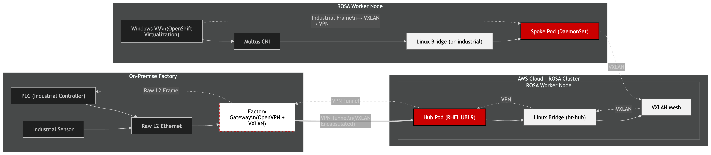

# Stretched layer 2 example with ROSA

## Goal

A customer approached the Black Belt team looking for a way for legacy systems, using protocols such as Profinet, BACNet etc could be connected to Virtual Machines running in OpenShift Virt on ROSA. This is an example way to do this without needing to edit ec2 instance NICs

## Overview

```
FACTORY FLOOR (L2)           AWS VPC / ROSA CLUSTER (L3)
==================           ===============================================

[ PLC / Sensor ]             [ WORKER NODE A ]           [ WORKER NODE B ]
      |                      |---------------|           |---------------|
      |                      | [ HUB POD ]   |           | [ SPOKE POD ] |
      |                      |    (UBI 9)    |           |    (UBI 9)    |
      |                      |       |       |           |       |       |
(Raw Ethernet)               |   [br-hub]    |<==VXLAN==>| [br-industrial]
      |                      |       |       |  (L2 over |       |       |
      |                      |    [tap0]     |   VPC L3) |   [Multus]    |
      |                      |       |       |           |       |       |
[ Factory Gateway ]          |   [OpenVPN]   |           | [ Windows VM ]|
[ (VPN + VXLAN)   ] <==VPN==>| [ (eth0)  ]   |           | [ (VirtIO)   ]|
==================           =================           =================
      ^                              ^                           ^
      |                              |                           |
  Physical Wire                The "Patch Panel"           The Workload
 (Profinet RT)                (Central Router)            (PCS 7 / App)
```

```
FACTORY SITE (Simulator)          OPENSHIFT CLOUD (Hub)              APP NAMESPACE (Spoke)
[ 192.168.100.1 ]               [ 192.168.100.10 ]                 [ No IP Required ]
       |                                |                                  |
   ( br-hub )                      ( br-hub )                         ( br-spoke )
       |                                |                                  |
    [tap0] <==== OpenVPN Tunnel ====> [tap0]                               |
    (L2)           (UDP 1194)         (L2)                                 |
                                        |                                  |
                                   [vxlan-hub] <===== VXLAN Tunnel ===== [vxlan-spoke]
                                      (L2)            (UDP 4789)            (L2)
                                                                             |
                                                                      ( Multus CNI )
                                                                             |
                                                                     [ Windows VM Pod ]
                                                                     [ 192.168.100.50 ]
```

Mermaid diagram:



## The Architecture: "Hub & Spoke" Tunneling
Since AWS VPCs are strictly Layer 3 and do not support native broadcast/multicast, we utilize a **Double-Encapsulation Tunnel** (VXLAN inside OpenVPN) to "hide" the Layer 2 frames from the AWS routing fabric.

1.  **The Hub (Deployment):** A central Red Hat UBI-based Pod that maintains an **OpenVPN (TAP mode)** connection to the factory. It acts as the "Grand Central Station" or "Virtual Patch Panel."
2.  **The Spoke (DaemonSet):** A Pod on every worker node that creates a local Linux bridge (`br-industrial`) on the host and "pipes" it back to the Hub via **VXLAN**.
3.  **The Workload (OpenShift Virtualization):** A Windows VM that uses **Multus CNI** to plug a secondary VirtIO NIC directly into the Spoke's local bridge.

### Logical Data Flow
`Windows VM (VirtIO)` -> `Multus Bridge` -> `VXLAN Tunnel` -> `Hub Pod Bridge` -> `OpenVPN TAP` -> `Factory PLC`

## Protocol Compatibility Matrix

| Protocol | Compatibility | Reason for Success/Failure |
| :--- | :--- | :--- |
| **BACnet/IP** | **YES** | Native L2 Discovery broadcasts (Who-Is/I-Am) pass through the tunnel. |
| **Profinet RT** | **YES** | Raw Layer 2 EtherType `0x8892` frames are preserved via the bridge-to-VXLAN mapping. |
| **PCS 7** | **YES** | Maintains MAC address persistence and L2 adjacency required for the Plant Bus. |
| **KNX (IP)** | **YES** | VXLAN handles the Multicast requirements that AWS VPCs natively block. |
| **M-Bus / Modbus** | **YES** | Most M-Bus/IP gateways use standard IP polling; L2 stretch simplifies discovery. |
| **UDP Broadcasts**| **YES** | Destination `255.255.255.255` is preserved across the tunnel. |

## Some gotchas to test

### 1. Disable Source/Destination Check (Critical)
AWS EC2 instances drop traffic if the source MAC/IP doesn't match the instance's own metadata. Because our VMs use "Factory" MAC addresses that don't belong to AWS, **you must disable the Source/Destination Check** on all ROSA worker nodes.
* **Action:** In the AWS EC2 Console, select the worker nodes -> **Actions > Networking > Change Source/Dest. Check** -> **Disabled**.

### 2. Security Context Constraints (SCC)
OpenShift is "Secure by Default." You must grant the `privileged` SCC to the service account running the Hub and Spoke pods to allow host-level network management.

```bash
oc adm policy add-scc-to-user privileged -z industrial-admin -n industrial-network
```

### 3. MTU Management
Double-encapsulation (VXLAN + OpenVPN) adds significant overhead. To prevent packet fragmentation (which breaks industrial handshakes):

- Action: Set the MTU on the Windows VM secondary NIC to 1350.

## What we tested and dismissed

### Standard CNI (L3 Only):

Why Discounted: AWS VPCs drop UDP broadcasts and non-IP frames (Profinet), making device discovery and real-time communication impossible.

### Cilium VTEP Integration:

Why Discounted: While excellent for standard IP-based traffic, it is primarily Layer 3 focused and does not natively support the pure Layer 2 EtherTypes required for PCS 7 or Profinet RT without node-level hacking.

### Pod Sidecar VPNs:

Why Discounted: Managing a VPN client per-pod was inefficient. It led to massive certificate management overhead and long re-connection delays during application restarts.

### Multus L2 connection to VXLAN on the nodes

Why Discounted: ROSA does not support adding additional NICs to nodes, and we did not want to use custom AMIs or init scripts to set this up


# Deployment

## Prerequisites

- A ROSA cluster with OpenShift Virtualization installed
- Multus CNI available (included by default on ROSA)
- `oc` CLI logged in with cluster-admin

## 1. Label the nodes

Pick one worker node as the hub and the rest as spokes:

```bash
oc label node <hub-node> industrial-role=hub
oc label node <spoke-node-1> industrial-role=spoke
oc label node <spoke-node-2> industrial-role=spoke
```

## 2. Disable Source/Destination Check (AWS only)

In EC2 Console: select all ROSA worker nodes -> **Actions > Networking > Change Source/Dest. Check** -> **Disabled**.

## 3. Deploy the infrastructure

```bash
# Create namespace, service account, and RBAC
oc apply -f namespace.yaml
oc apply -f serviceaccount.yaml
oc apply -f rolebinding.yaml

# Build the networking tools image
oc apply -f image-build.yaml

# Create VPN config (edit vpn-auth-secret.yaml first to set the remote endpoint)
oc apply -f vpn-auth-secret.yaml

# Create the cert secret (see vpn-auth-secret.yaml for the command)

# Deploy hub and spoke
oc apply -f vpn-hub-deployment.yaml
oc apply -f vxlan-termination-daemon-set.yaml
```

## 4. Deploy test VMs

```bash
oc apply -f vm-test/namespace.yaml
oc apply -f vm-test/network-attachment-definition.yaml
oc apply -f vm-test/linux-vm.yaml
```

# Testing the solution

## Simulator test (single cluster, no external VPN)

Use the in-cluster factory simulator to validate the full data path without needing an external server.

```bash
# Generate certs and deploy everything
cd simulator-test
bash reset_lab.sh
```

### Validation steps

1. **VPN tunnel**: Check the hub pod logs for a successful OpenVPN connection:
   ```bash
   oc logs deployment/industrial-hub -n industrial-network | grep "Initialization Sequence Completed"
   ```

2. **Bridge and VXLAN**: Exec into the hub pod and verify the bridge has all interfaces:
   ```bash
   oc exec -n industrial-network deployment/industrial-hub -- bridge link show
   # Should list: tap0, vxlan-hub
   ```

3. **L2 connectivity (hub to simulator)**: Ping the simulator from the hub:
   ```bash
   oc exec -n industrial-network deployment/industrial-hub -- ping -c3 192.168.100.1
   ```

4. **End-to-end (VM to simulator)**: From the Fedora test VM console, ping the simulator:
   ```bash
   virtctl console fedora-test-station -n industrial-spoke
   # Inside the VM:
   ping 192.168.100.1
   ```

## On-prem real-world test

Runs the factory simulator as a KVM VM on the on-prem server, keeping the host
networking untouched.

### On the on-prem server

```bash
cd onprem-simulator

# Set HOST_BRIDGE to the bridge with external connectivity (default: virbr0)
export HOST_BRIDGE=virbr0

# Creates the VM, generates PKI, boots with cloud-init
sudo bash setup-factory-vm.sh

# Wait ~30s, then get the VM IP
virsh domifaddr factory-simulator

# If the VM is on a NAT bridge, forward UDP 1194 from the host
sudo bash port-forward.sh <VM_IP>
```

### On the ROSA cluster

```bash
# Create the cert secret using the PKI generated on the on-prem server
# (copy pki/ dir from on-prem, or scp the individual files)
oc create secret generic factory-vpn-auth \
  --from-file=ca.crt=ca.crt \
  --from-file=client.crt=client.crt \
  --from-file=client.key=client.key \
  -n industrial-network

# Edit vpn-auth-secret.yaml: set 'remote' to the on-prem server's public IP
# Then deploy everything as in the deployment section above
```

### Validation

```bash
# 1. Hub VPN connected?
oc logs deployment/industrial-hub -n industrial-network | grep "Initialization Sequence Completed"

# 2. Ping the factory bridge from the hub
oc exec -n industrial-network deployment/industrial-hub -- ping -c3 192.168.100.1

# 3. Ping the simulated PLC from the hub
oc exec -n industrial-network deployment/industrial-hub -- ping -c3 192.168.100.50

# 4. End-to-end: ping from the VM
virtctl console fedora-test-station -n industrial-spoke
# Inside VM: ping 192.168.100.50
```

## Cluster-to-Cluster variant

See [cluster-to-cluster/](cluster-to-cluster/) for a variant that connects
two OpenShift clusters at Layer 2 using the same architecture. Tested with
on-prem bare-metal OpenShift (VPN server) and ROSA HCP (VPN client) at ~18ms
cross-cluster latency.

## Known issues and workarounds

### ROSA HCP / OVN-Kubernetes: no inbound to hostNetwork pods

hostNetwork pods behind LoadBalancer or NodePort services do not work on
ROSA HCP (OVN-Kubernetes). Cross-node DNAT fails because hostNetwork traffic
bypasses OVN's Geneve overlay. Workaround: run the VPN server on the on-prem
cluster and make ROSA the outbound VPN client.

### `bridge fdb replace` unsupported on some kernels

On ROSA HCP worker nodes, `bridge fdb replace` returns "Operation not
supported" for VXLAN FDB entries. Use `bridge fdb append` instead — it is
idempotent for new entries and silently ignores duplicates.

### Fedora VM interface naming and NetworkManager

Fedora container disk images name the second NIC `enp2s0` (PCI bus naming),
not `eth1`. Additionally, NetworkManager removes IPs set via `ip addr add`.
Use a persistent NetworkManager connection file via cloud-init `write_files`
instead of `runcmd` with `ip addr add`.

### OpenVPN `server-bridge` assigns IP to tap0

When using `server-bridge`, OpenVPN assigns an IP to the `tap0` interface.
Since tap0 is a bridge slave, this creates a conflicting route that prevents
traffic from using `br-hub`. The hub scripts strip this IP automatically
after the tunnel comes up.
